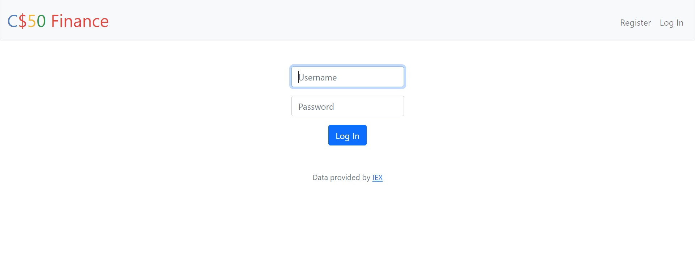
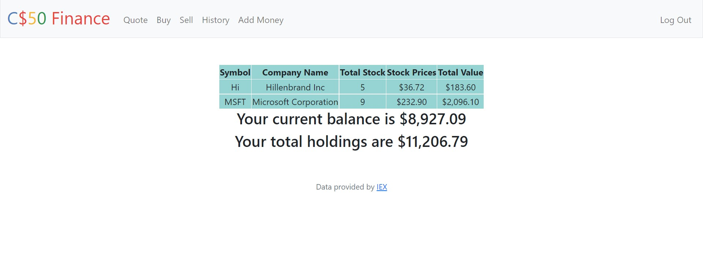
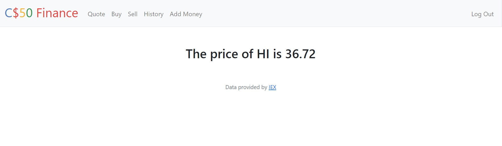
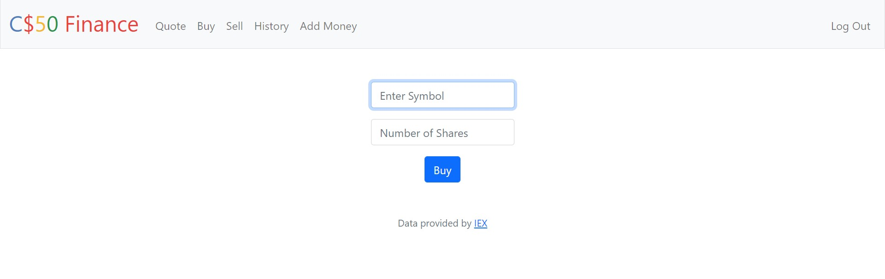
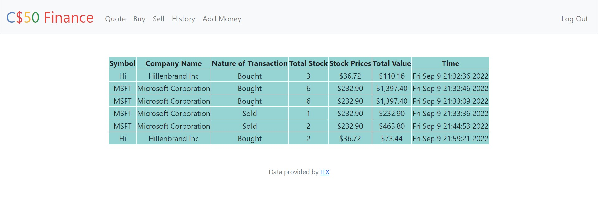
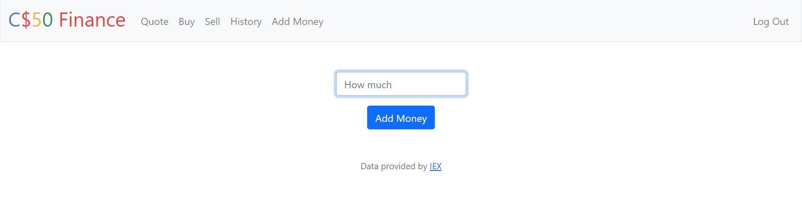

# Stock simulator

<br/>


<!-- ABOUT THE PROJECT -->
## **About The Project**
In current world buying and selling stocks is a powerful way to earn money. If done right people can become millionares over the years. But it also has its risk. Not all have the luxary to invest huge sums to try the market. This is where this project comes in picture. This project simulates buying and selling of stocks which gives them a rough idea if the endevour will reciprocate desired results.

## **Key Features**
1. Register, Login/Logout
2. Lookup current price of various stocks
3. Buy and sell stocks
4. Lookup previously bought and sold stocks
5. Add money to furthur invest
6. Check current balance and holdings

<br/>
<br/>


### **Tech Stack Used**

* [Python](https://www.python.org/)
* [Flask](https://flask.palletsprojects.com/en/2.2.x/)
* [HTML & CSS]()
* [SQL](https://www.javascript.com/)

<br/>


### **How to use**
Python must be installed on your system if running locally.

1. Clone the repo
   ```sh
   git clone https://github.com/Harsh-159/Stock-Simulator.git
   ```

2. Install requirements
   ```sh
   pip install -r requirements.txt
   ```
3. Visit the following site and start a free trial as "individual" account type
   ```sh
   https://iexcloud.io/cloud-login#/register/
   ```
4. Visit the following site and copy the key that appears under the token column(it should begin with pk_)
   ```sh
   https://iexcloud.io/console/tokens
   ```
5. In the terminal window, execute
   ```sh
   $ export API_KEY=value
   ```
6. Run flask server
  ```sh
   flask run
   ```

<br/>

## **Screenshots**
<div align="center" ><br/>
Login page<br/><hr width=600/>
  <br/><br/>
Homepage<br/><hr width=600/>
  <br/><br/>
Check price of current stock<br/><hr width=600/>
  <br/>
Buying Stock<br/><hr width=600/>
  <br/><br/>
Checking History<br/><hr width=600/>
  <br/><br/>
Add money to current balance<br/><hr width=600/>
  <br/>
</div>
<br/>


<!-- CONTACT -->
### **Contact**
Harsh Yadav - harshyadavhappy@gmail.com

<br/>
